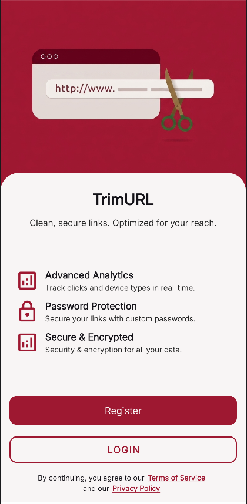
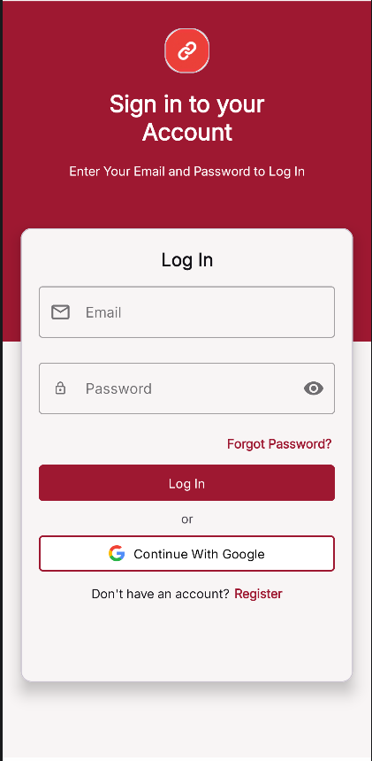
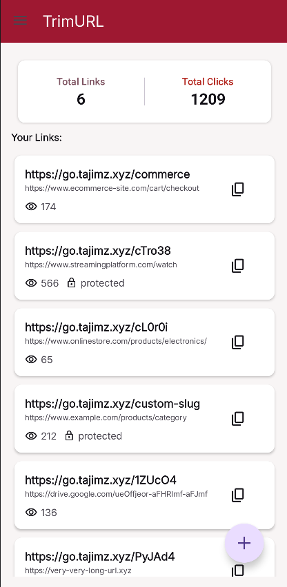
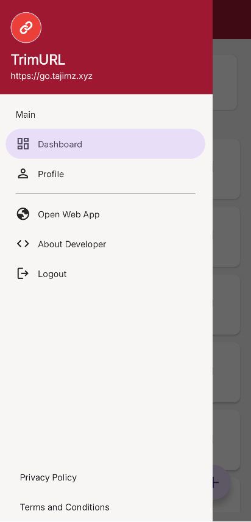

# TrimURL - URL Shortener Android App 📱

A modern Android client for the UrlShortener service, built with Java, OkHttp, and Material Design.
This app allows users to shorten URLs, manage links, and handle authentication (email/password + Google Sign-In).

The backend API is shared with the web application:
👉 [https://github.com/tajimz/url-shortener-spa](https://github.com/tajimz/url-shortener-spa)

---

## ✨ Features

* 🔐 Email/password authentication
* 🔑 Google Sign-In support
* ✂️ Create short URLs instantly
* 📋 Copy shortened links to clipboard
* 📊 View all created URLs in dashboard
* 👤 User profile management
* 🔄 Pull-to-refresh URL list
* 🚦 Auto session handling with token-based auth
* ⚠️ Email verification flow support

---

## 📥 Downloads

👉 APK available on APKPure:  
https://apkpure.com/com.tajim.urlshortener

## 📸 Screenshots
---

| Landing | Login | Dashboard | Modern Menu |
| ------- | ----- | --------- | ----------- |
|  |  |  |  | 
---

## 🏗️ Architecture Overview

The app follows a **clean modular structure**:

```
api/        → Network layer (OkHttp, endpoints, interceptors)
auth/       → Authentication screens & logic
ui/         → Activities + Fragments (UI layer)
adapter/    → RecyclerView adapters
model/      → Data models
utils/      → Shared helpers (Session, UI utilities)
```

### Key Components

* **ApiClient** → OkHttp client with authentication interceptor
* **AuthApi / UrlApi** → API endpoints wrapper
* **SessionManager** → Handles login state & token storage
* **AuthInterceptor** → Handles 401/403 auto-routing
* **DashboardFragment** → Main URL list view

---

## 🔗 Backend API

This app uses a shared backend API with the web version.

👉 Full API documentation & backend source:
[https://github.com/tajimz/url-shortener-spa](https://github.com/tajimz/url-shortener-spa)

Base endpoints:

* `/login`
* `/social-login`
* `/register`
* `/logout`
* `/urls`
* `/me`
* `/verification/send`

---

## ⚙️ Tech Stack

* Java (Android)
* OkHttp 4.12
* AndroidX Libraries
* Material Design Components
* Google Identity Services (Sign-In)
* ViewBinding
* SharedPreferences (Session management)

---

## 📱 App Flow

1. User launches app
2. Session check in `MainActivity`
3. Redirect to:

   * `LandingActivity` → if not logged in
   * `VerifyEmailActivity` → if email not verified
   * `MainActivity` → if authenticated
4. Dashboard loads user URLs from API
5. User can create and manage short links

---

## 🚀 Setup & Installation

### Prerequisites

* Android Studio Hedgehog or later
* Minimum SDK: 29
* Internet connection

### Steps

```bash
git clone https://github.com/tajimz/url-shortener-android.git
```

1. Open project in Android Studio
2. Sync Gradle dependencies
3. Set backend URL in `build.gradle`:

```gradle
buildConfigField "String", "SERVER_BASE_URL", "\"https://your-api-url.com\""
```

4. Run on emulator or physical device

---

## 🔧 Configuration

### Backend URL

Change in:

```gradle
buildTypes {
    debug {
        buildConfigField "String", "SERVER_BASE_URL", "\"http://192.168.1.6:8000\""
    }
    release {
        buildConfigField "String", "SERVER_BASE_URL", "\"https://your-server.xyz\""
    }
}
```

---

## 📂 Project Structure

```
com.tajim.urlshortener/
├── api/
├── auth/
├── adapter/
├── model/
├── ui/
│   ├── activities/
│   └── fragments/
└── utils/
```

---

## 🔐 Authentication

* JWT-based authentication
* Token stored securely in SharedPreferences
* Auto logout on 401 responses
* Email verification required for full access

---

## 🧪 Testing

* Debug build uses local backend server
* Release build uses production API
* Tested on Android 10+

---

## 📌 Notes

* Clipboard copy is enabled for all shortened URLs
* Opening URLs directly in browser is currently optional (can be enabled in adapter)
* `ViewUrlActivity` is reserved for future detailed URL view screen

---

## 🤝 Contribution

Pull requests are welcome.

* Keep changes small and focused
* Follow existing architecture
* Include screenshots for UI changes

---

## 📜 License

Copyright © 2026 Tajim
All rights reserved unless stated otherwise in a LICENSE file.

---

## 👨‍💻 Developer

Built by **Tajim**
🌐 [https://tajimz.xyz](https://tajimz.xyz)

---

